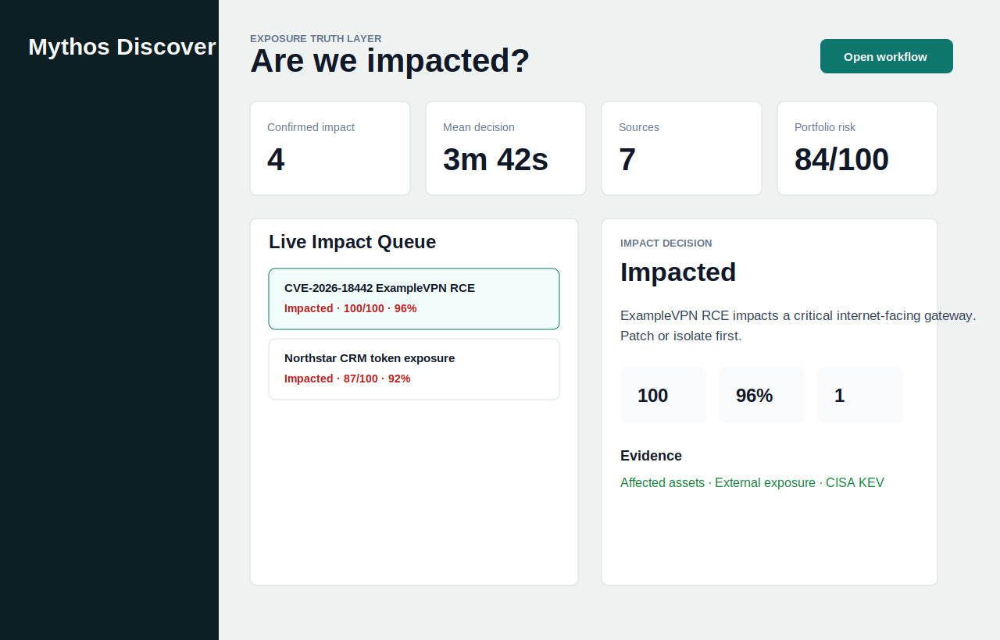
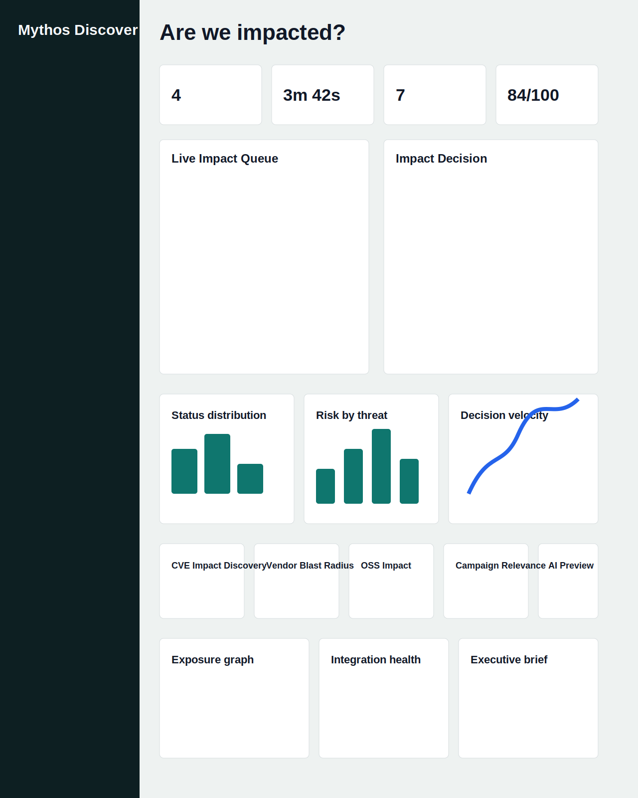
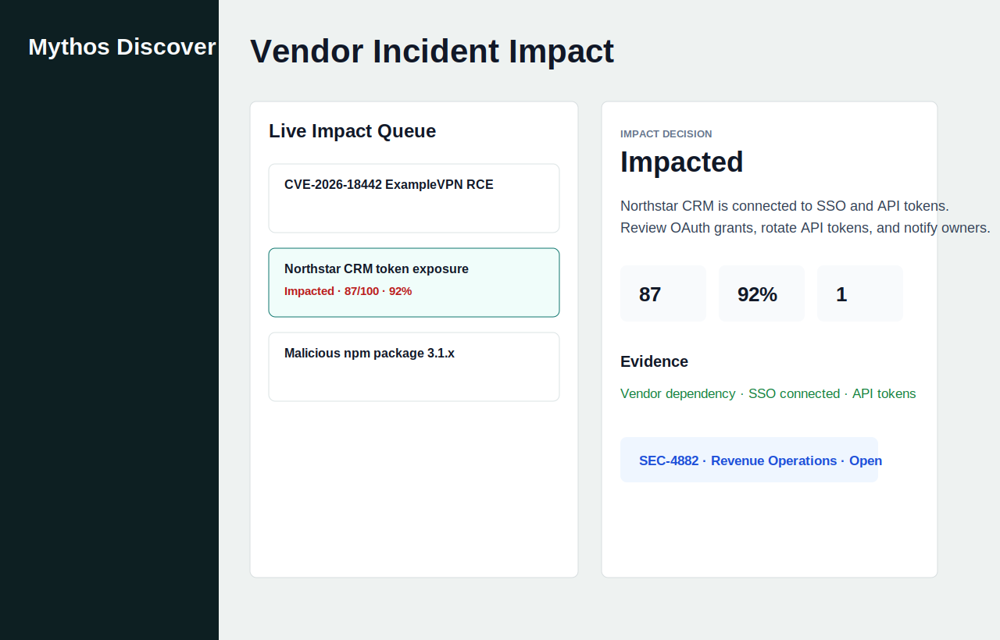
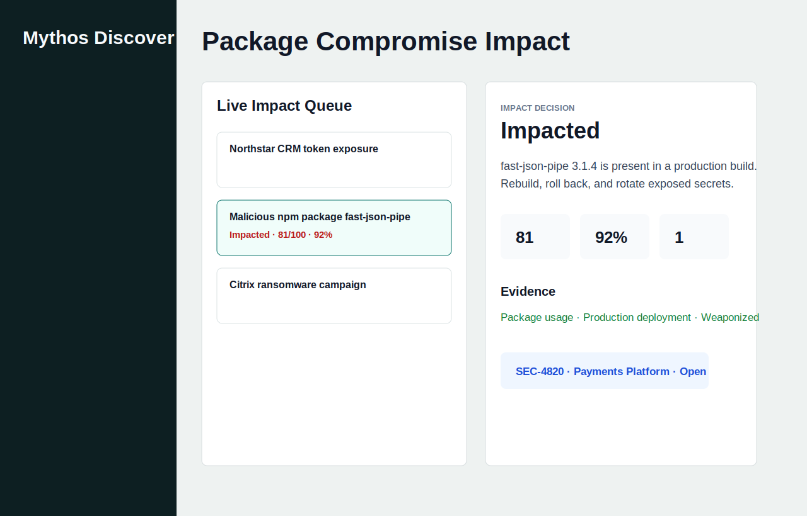

# Mythos Discover

Mythos Discover answers the CISO question: **Are we impacted?**

It maps breaking CVEs, vendor incidents, exploit rumors, package compromises, and threat campaigns against internal environment context: assets, software versions, vendors, packages, owners, controls, tickets, and business impact.

## Product Areas

- CVE impact discovery
- Vendor incident blast-radius analysis
- Open-source package compromise discovery
- Threat campaign relevance scoring
- Exposure graph
- Evidence-backed impact reports
- Remediation workflow surfaces
- Executive brief generation
- Adapter boundaries for scanners, cloud inventory, SBOM, SIEM, EDR, identity, and ticketing

## Product Screenshots

### Command Center



### Full Dashboard



### Vendor Incident Impact



### Package Compromise Impact



## Run Locally

```bash
npm install
npm run dev
```

## Validate

```bash
npm run typecheck
npm run test
npm run lint
npm run build
npm audit --audit-level=moderate
```

## Architecture

```text
External signals -> adapters -> exposure graph -> impact engine -> reports/workflows -> UI
```

Production connectors should implement the interfaces in `src/domain/adapters.ts` and route secrets through a backend service, not the browser.
